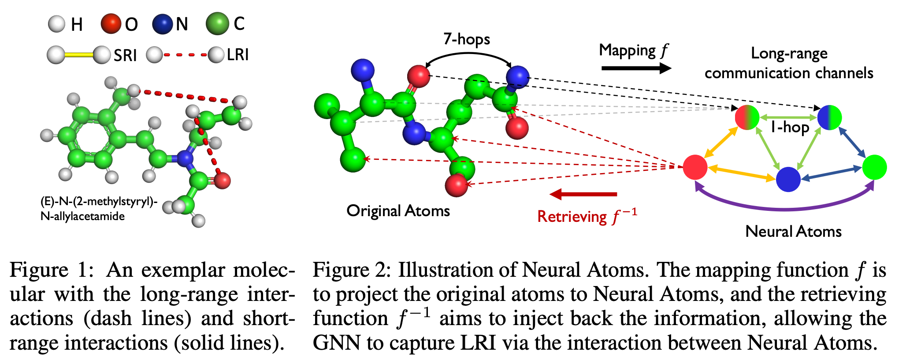
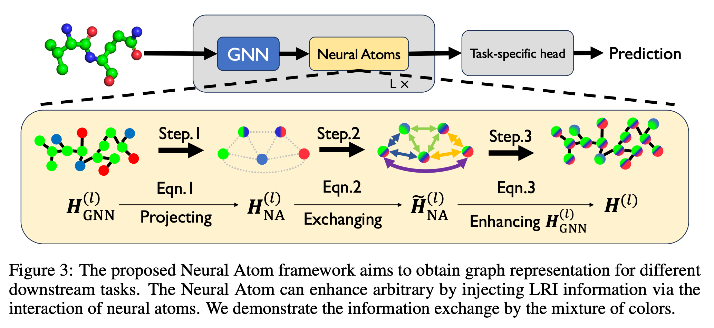

<p align="center"></p>


<!-- <h1 align="center"> -->
Official code for the paper "Neural Atoms: Propagating Long-range Interaction in Molecular Graphs through Efficient Communication Channel" (ICLR 2024).
<!-- </h1> -->
<!-- <p align="center"> -->
<a href="https://arxiv.org/abs/2311.01276"></a>
<a href="https://openreview.net/pdf?id=Vcl3qckVyh"></a>
<a href="https://github.com/XuanLi728/Neural_Atom"></a>


## Introduction
Graph Neural Networks (GNNs) have been widely adopted for drug discovery with molecular graphs. Nevertheless, current GNNs mainly excel in leveraging short-range interactions (SRI) but struggle to capture long-range interactions (LRI), both of which are crucial for determining molecular properties. 

To tackle this issue, we propose a method to abstract the collective information of atomic groups into a few ***Neural Atoms*** by implicitly projecting the atoms of a molecular. Specifically, we explicitly exchange the information among neural atoms and project them back to the atoms’ representations as an enhancement. 

With this mechanism, neural atoms establish the communication channels among distant nodes, effectively reducing the interaction scope of arbitrary node pairs into a single hop. 

<table><tr>
<td></td>
</tr></table>
<p align="center"><em>Figure 1.</em> Problem definition and motivation.</p>

<table><tr>
<td></td>
</tr></table>
<p align="center"><em>Figure 2.</em> The workflow of Neural Atoms.</p>


## Installation (2D scenario)
We have tested our code on `Python 3.8` with `PyTorch 1.12.1`, `PyG 2.2.0` and `CUDA 11.3`. Please follow the following steps to create a virtual environment and install the required packages.

Create a virtual environment and install dependencies:
```
conda env create -f 3D_Molecule/env.common.yml

conda install pytorch=1.12.1 torchvision torchaudio -c pytorch -c nvidia
conda install pandas scikit-learn
conda install openbabel fsspec rdkit -c conda-forge
pip install dgl-cu111 dglgo -f https://data.dgl.ai/wheels/repo.html

pip install performer-pytorch
pip install torchmetrics==0.7.2
pip install ogb
conda activate neural_atom
```

## Reprodution
We provide commands for 2D and 3D scenario to reproduce the paper as follows.

### 2D molecular graphs (LRGB)

Will release soon. The implementation of NeuralAtom can refer to [here](3D_Molecule/README.md).


### 3D molecular graphs (OE62)
The installation and full commands for 3D scenario can be found at [here](3D_Molecule/README.md). 


## Citation

If you find our work useful, please kindly cite our paper:

```bibtex
@inproceedings{li2024neuralatoms,
  title={Neural Atoms: Propagating Long-range Interaction in Molecular Graphs through Efficient Communication Channel},
  author={Xuan Li and Zhanke Zhou and Jiangchao Yao and Yu Rong and Lu Zhang and Bo Han},
  booktitle={ICLR},
  year={2024},
}
```
